# JAVA APPLICATION Tutorial (Indonesia)

## Pendahuluan

Aplikasi ini adalah aplikasi yang berbasis bahasa pemrograman Java, dengan menggunakan *Java Application*,
atau bisa disebut juga *Java Swing*. Di sini akan dijelaskan tutorial yang difungsikan untuk melakukan pengambilan data universitas yang telah dibuat di database dengan menggunakan [JDBC MySql](dev.mysql.com/downloads/connector/j/).

Kira-kira hasil dari tutorial ini akan seperti pada gambar dibawah ini.
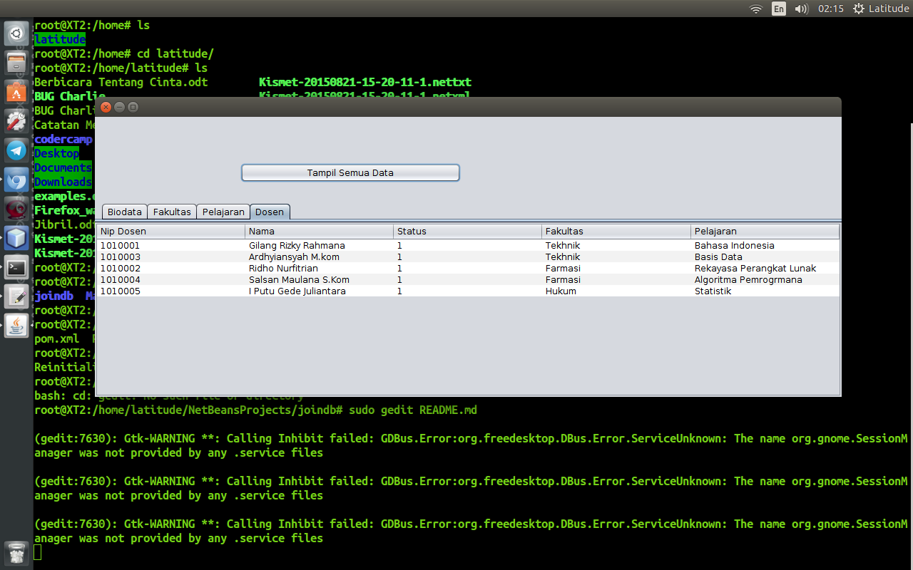

Berikut dijelaskan tutorial instalasi secara step-by-step.

## Tutorial Aplikasi

Untuk tutorial kali ini akan dibagi menjadi beberapa *part* dari awal hingga akhir. Semoga mudah dimengerti dan aplikasi
bisa dijalankan dengan benar sehingga dapat berguna.

## Step-1 (Download Projek & Buat Database)

1. Masuk ke repositori yang telah saya buat di github: https://github.com/naufaltrix/uts_joindb_4513215046
dan anda akan masuk ke halaman sebuah *GitHub-Repo* seperti gambar dibawah ini.
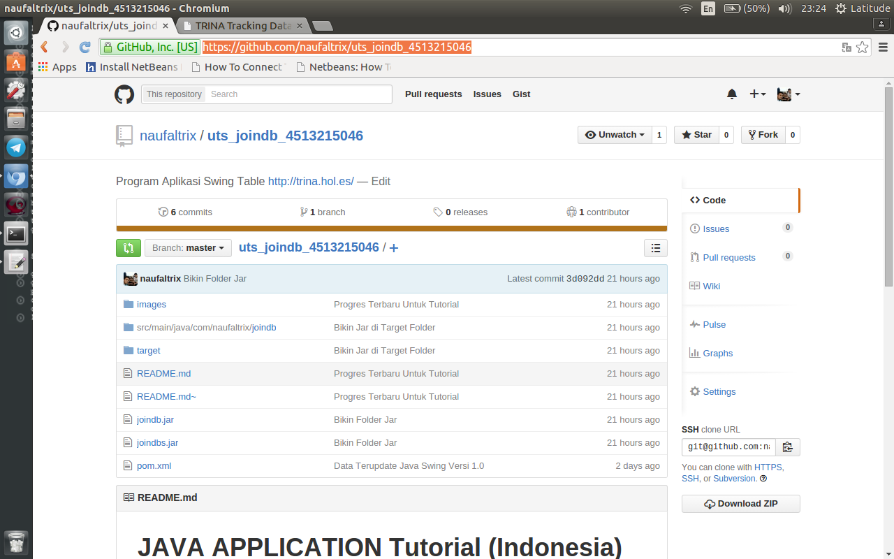

2. Setelah masuk dan melihat tampilan repositori di atas, selanjutnya adalah *download zip folder* yang ada di sidebar kanan.
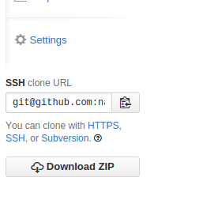

3. Setelah selesai di-download, lakukan *extract* pada folder zip tersebut. lalu masukan dump file mysql **universitas.sql** ke *database* lokal *phpmyadmin* pada komputer anda dengan membuka terminal lalu aktifkan [xampp](https://www.apachefriends.org/download.html) sebagai *database local server* dan *compiler* dengan ketik di terminal: `/opt/lamp/lamp start`
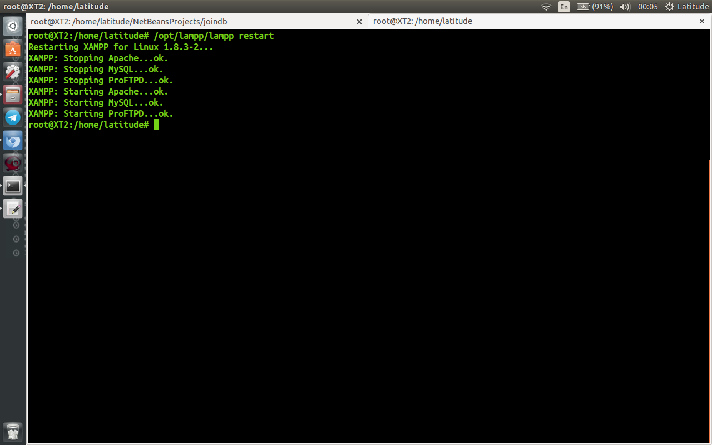 Catatan: jika anda menggunakan Windows, buka seperti biasa program XAMPP lalu aktifkan modul *Apache* dan *MySQL*.

4. Buka browser lalu ketik pada *addressbar*: `localhost/phpmyadmin` dan akan terlihat tampilan pada gambar dibawah ini.
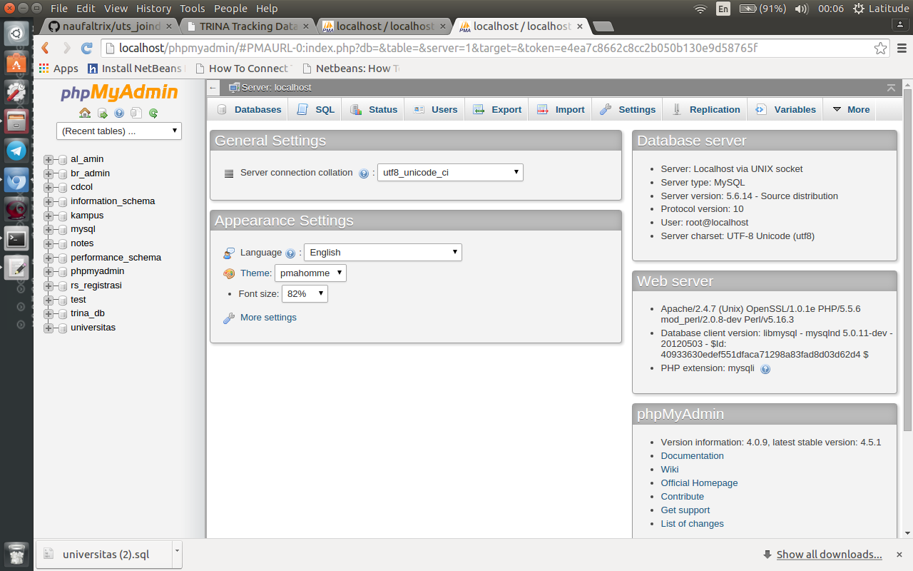

5. Setelah itu, buat database baru dengan nama **universitas** dengan klik menu *database* seperti gambar dibawah ini.
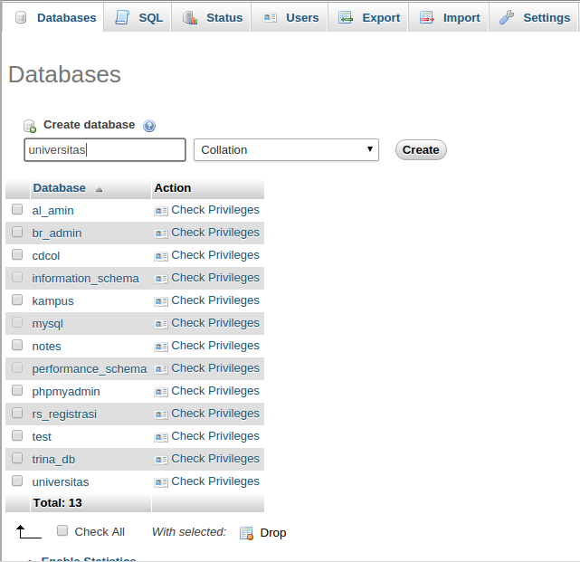

6. Setelah selesai, klik tombol **create** dan hasilnya akan seperti gambar dibawah ini.
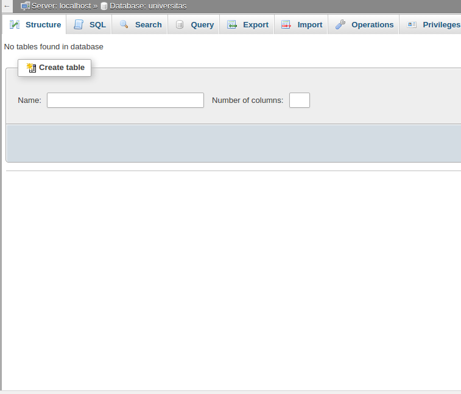

7. Setelah database selesai dibuat, langkah selanjutnya adalah *import dump file* **unversitas.sql** yang ada di dalam folder yang telah diekstrak, seperti pada gambar dibawah ini.
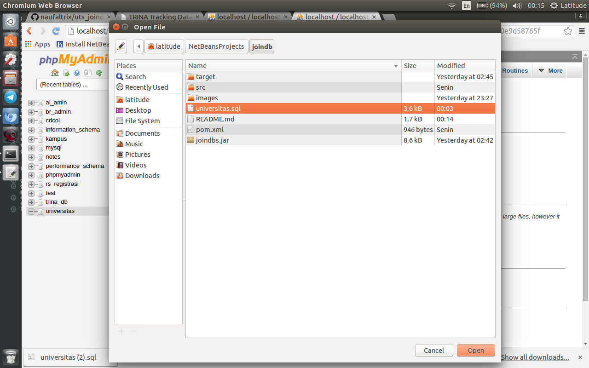

8. Setelah dipilih file **unversitas.sql**, terakhir klik `GO` untuk kemudian database dapat di-*import*.
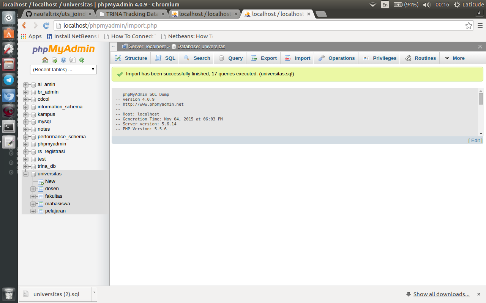 maka bisa dilihat strukturnya akan seperti pada gambar dibawah ini. 

9. Selesai

Untuk step pertama, sampai saat ini kita sudah selesai melakukan download dan juga melakukan ekstrak data serta membuat database pada server
lokal di PhpMyadmin dengan XAMPP.

## Step-2 (Menjalankan Program di Netbeans)

Disini akan dijelaskan untuk step-2 yaitu menjalankan projek yang telah di-*download* dari repositori GitHub, dengan mengikuti step-2 ini dari awal hingga akhir, diharapkan user dapat mengerti dan juga paham untuk bisa menjalankan aplikasi yang sudah dibuat.

1. Langkah pertama adalah buka aplikasi [Netbeans](https://netbeans.org/downloads/) pada komputer anda. (Di sini saya asumsikan bahwa user telah menginstall Netbeans).
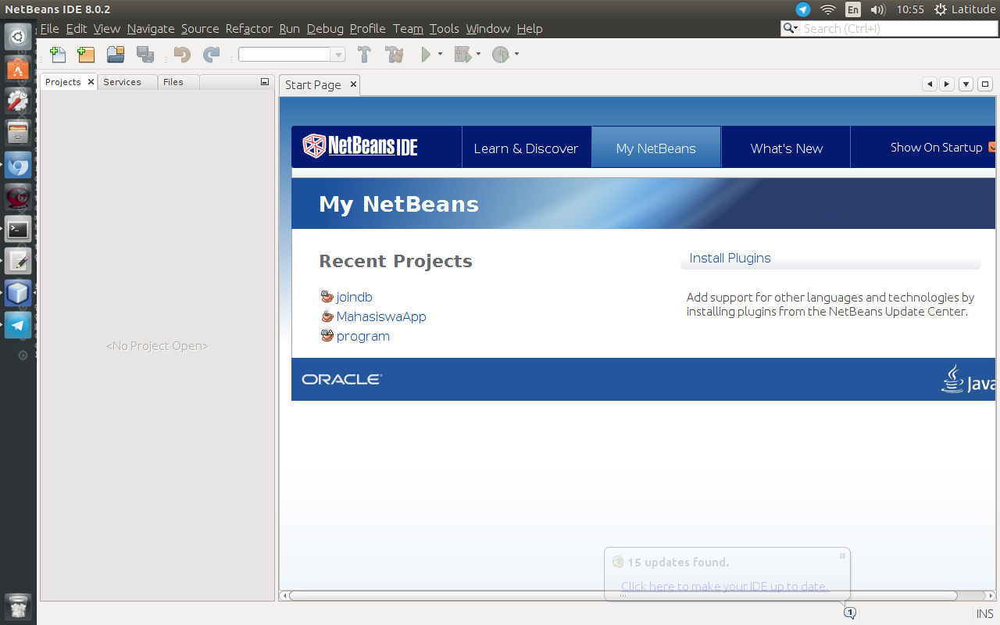

2. Klik *File -> Open Project* maka akan muncul sebuah *window* seperti pada gambar dibawah ini.
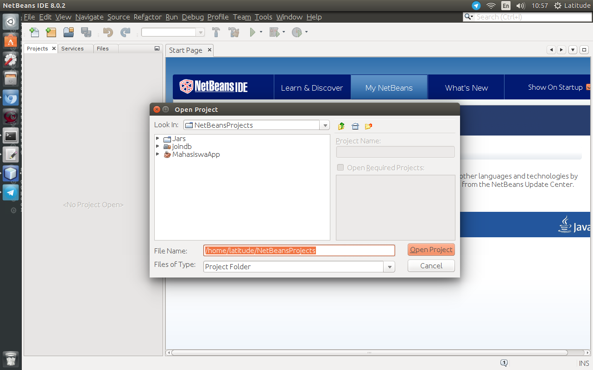

3. Setelah projeknya tampil, maka langkah selanjutnya adalah tekan tombol **F6** atau tekan tombol *Run* pada Netbeans untuk melakukan *running program*, dan hasilnya akan terlihat seperti pada gambar dibawah ini.
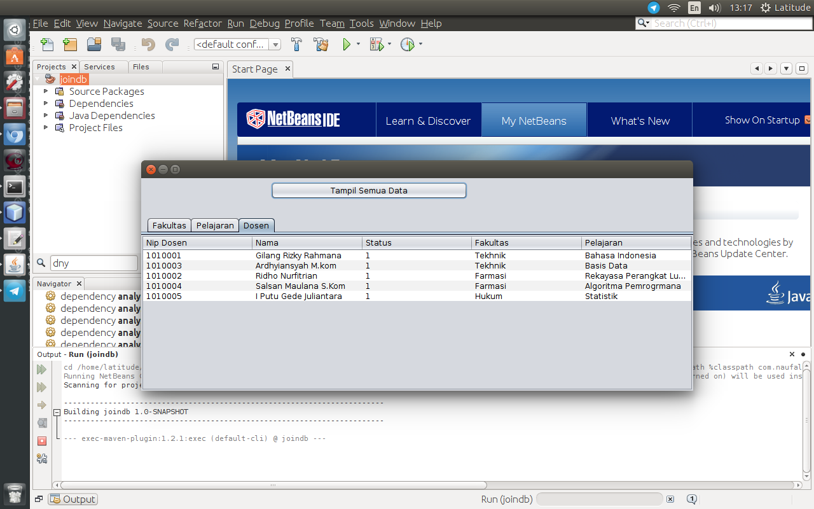

## Step 3 (Cek Database di Server)

Data pada aplikasi sudah sesuai dengan data pada server dengan masuk ke url `http://trina.hol.es/` dan akan terlihat hasilnya seperti pada gambar dibawah ini.
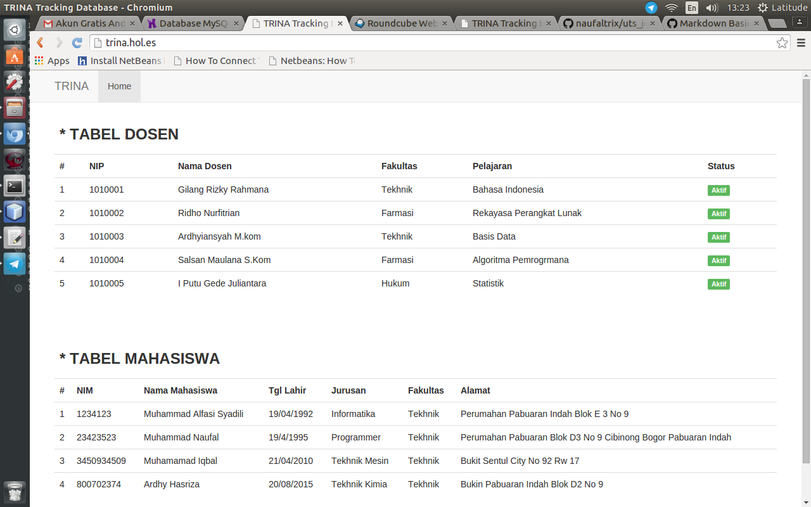

# Selesai !!

